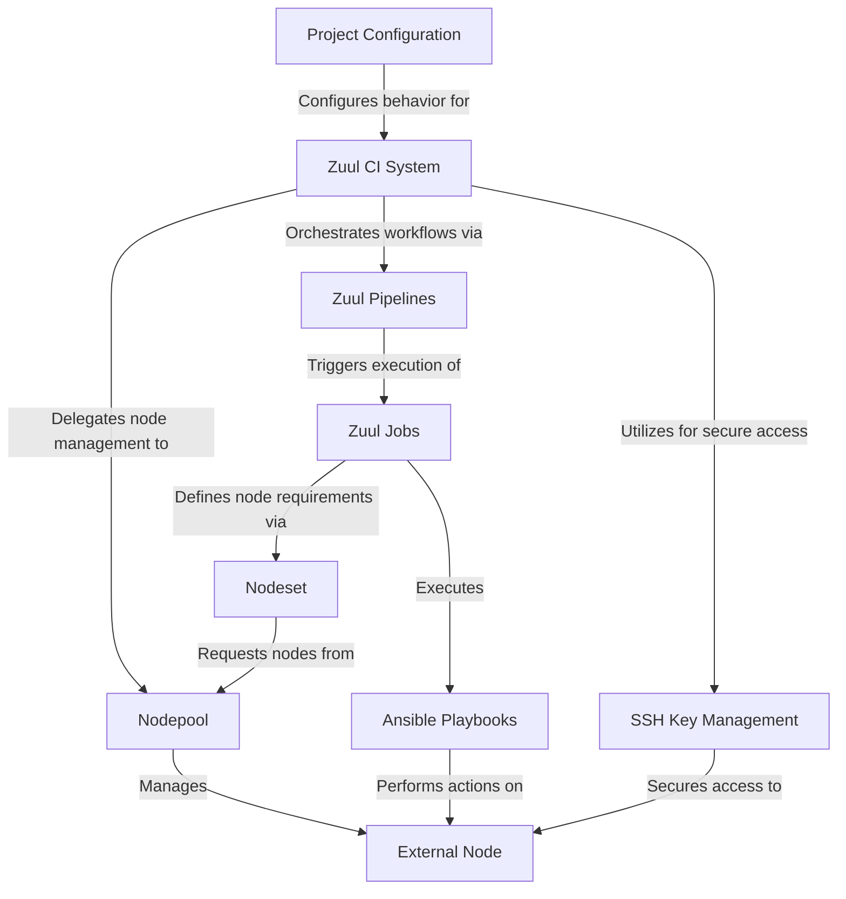

# Tutorial: nodes_zuul_config

This project demonstrates how to set up the **Zuul CI System** to utilize *external machines* for running continuous integration jobs. It guides users through configuring **SSH Key Management** for secure access, defining **Nodepool** settings to manage these external nodes, and structuring **Zuul Pipelines** and **Jobs** to execute automated tasks on them. Essentially, it's a blueprint for distributed CI/CD with Zuul.


## Visual Overview




# Node setup

Complete Step-by-Step Guide: Setting up Zuul with External Node
Prerequisites
- Two machines: Main Machine (Zuul server) and Node Machine (execution node)
- Both machines should be on the same network and able to ping each other
- Docker and Docker Compose installed on Main Machine
- SSH access between machines


# On Main Machine (Zuul Server)
## Step 1: Clone and Setup Zuul
```
git clone https://opendev.org/zuul/zuul
```
```
cd zuul/doc/source/examples
```
### Generate SSH keys for nodepool
```
mkdir -p playbooks/files
```
```
ssh-keygen -t rsa -f ./playbooks/files/nodepool -N "" -q
```
```
chmod 600 playbooks/files/nodepool
```
```
chmod 644 playbooks/files/nodepool.pub
```
### cat nodepool.pub
```
cat playbooks/files/nodepool.pub
```
The above **cat playbooks/files/nodepool.pub** shows the key starts from *ssh-rsa AAA...* copy the publick key, we need to paste it in [Node machine](https://github.com/Minson2951/nodes_zuul_config/blob/main/README.md#copy-the-cat-nodepoolpub-from-main-machine-and-paste-it-here) later.

## Step 2: Configure Docker Compose and nodepool.yaml
Edit docker-compose.yml and find the executor service. Add volume mounts:

    executor:
      #... existing configuration ...
      volumes:
         .... add the below two lines...
        - ./playbooks/files/nodepool:/root/.ssh/id_rsa:ro
        - ./playbooks/files/nodepool.pub:/root/.ssh/id_rsa.pub:ro

Edit nodepool.yaml to add node:

    labels:
      -name: ubuntu-jammy # default
      -name: external-node # added
	  -name: ... add multiple nodes


    providers:
	  -name: static-vms
		driver: static
	    pools:
	      - name: main
	        nodes:
	          - name: node
	            labels: ubuntu-jammy
	            host-key: "ssh-ed25519 AAAAC3NzaC1lZDI1NTE5AAAAIOgHJYejINIKzUiuSJ2MN8uPc+dfFrZ9JH1hLWS8gI+g"
	            python-path: /usr/bin/python3
	            username: root
	          - name: Ip address # add your node Ip address
	            labels: external-node
	            host-key: "Key" # replace your key
	            python-path: /usr/bin/python3
	            username: user # replace your user name
          

- Note: To [Get ip address, host key, username](https://github.com/Minson2951/nodes_zuul_config/blob/main/README.md#ip-host-key-and-username) run the commands in Node machine, copy it and replace it.
	 
Note: for host-key it returns 
**ssh-ed25519 AAAAC3NzaC1lZDI1NTE5AAAAIAcTTab4ZllNk9u+j+zI8gKzX5M0wxhFV3bOLgxPziP4 root@hostname** 

paste only *ssh-ed25519 AAAAC3NzaC1lZDI1NTE5AAAAIAcTTab4ZllNk9u+j+zI8gKzX5M0wxhFV3bOLgxPziP4* in **nodepool.yaml**

### Note: Now follow [Node machine setup](https://github.com/Minson2951/nodes_zuul_config/blob/main/README.md#on-node-machine-execution-node) below and then continue Step 3 and Step 4 on Main machine
## Step 3: Start Zuul Services
#### Start services
```
sudo docker-compose up -d
```
#### Wait for full startup
```
sleep 90
```
## Step 4: Verify Setup
#### Check if nodepool recognizes the node
```
sudo docker exec examples_launcher_1 nodepool list
```
Expected output

| ID | Provider | Label  | Server ID | Public IPv4  | IPv6 | State | Age | Locked |
|--|--|--|--|--|--|--|--|--|
| 0000000019 | static-vms | ubuntu-jammy | node | NODE_IP |  |ready | 20:00:50:35 | unlocked |
0000000005 | static-vms | external-node | NODE_IP | NODE_IP |  | ready | 00:00:10:00 | unlocked |

### Extra verification
```
sudo docker exec examples_executor_1 ssh -o StrictHostKeyChecking=no minson@NODE_IP "echo SSH test successful"
```
This should return *SSH test successful*


Now the Node setup is ready add your Node in [jobs.yaml](https://github.com/Minson2951/nodes_zuul_config/blob/915c40574b181b2ed8de18d7eaab69ffd827ced2/zuul.d/jobs.yaml) with another name and run your job on that node.

# On Node Machine (Execution Node)

## Step1: Install SSH Server
Open terminal in files, and perform the below:
```
sudo apt update
```
```
sudo apt install openssh-server
```
## Step 2: Prepare User and SSH Directory
### Create SSH directory (replace 'minson' with your username)
```
sudo mkdir -p /home/minson/.ssh
```
```
sudo chmod 700 /home/minson/.ssh
```

### Copy the [cat nodepool.pub](https://github.com/Minson2951/nodes_zuul_config/blob/main/README.md#cat-nodepoolpub) from Main Machine and paste it here
```
echo 'PASTE_PUBLIC_KEY_HERE' | sudo tee /home/minson/.ssh/authorized_keys
```

### Set proper permissions
```
sudo chmod 600 /home/minson/.ssh/authorized_keys
```
```
sudo chown -R minson:minson /home/minson/.ssh
```
### Make sure SSH service is running
```
sudo systemctl status ssh
```
## IP, Host key and Username
#### Ip address
 ```
 hostname -I
```
#### Host key
 ```
 sudo cat /etc/ssh/ssh_host_ed25519_key.pub
```
#### Username
```
whoami
```

# Note:
For Node machines, we need to remove sudo access, for accessing the machines:
Open terminal in Node machine:
```
sudo visudo
```
at the end of add this below line
```
username ALL=(ALL) NOPASSWD:ALL
```
replace the username with actual [username](https://github.com/Minson2951/nodes_zuul_config/blob/main/README.md#username) 

# Troubleshooting Common Issues
## If SSH fails:
### Check if keys match
```
cat playbooks/files/nodepool.pub
```
```
sudo docker exec examples_executor_1 cat /root/.ssh/id_rsa.pub
```
###  Manual key copy (if volumes aren't working)
```
sudo docker cp playbooks/files/nodepool examples_executor_1:/root/.ssh/id_rsa
```
```
sudo docker cp playbooks/files/nodepool.pub examples_executor_1:/root/.ssh/id_rsa.pub
```
```
sudo docker exec examples_executor_1 chmod 600 /root/.ssh/id_rsa
```
```
sudo docker exec examples_executor_1 chmod 644 /root/.ssh/id_rsa.pub
```
### Debug SSH connection
```
sudo docker exec examples_executor_1 ssh -vvv -o StrictHostKeyChecking=no minson@NODE_IP "echo test"
```
### Restart services
```
sudo docker-compose restart
```

# Common commands
### Stop any running services
```
sudo docker-compose down
```
### Clean everything
```
sudo docker system prune -af
```
```
sudo docker volume prune -f
```
### Start services
```
sudo docker-compose up -d
```

